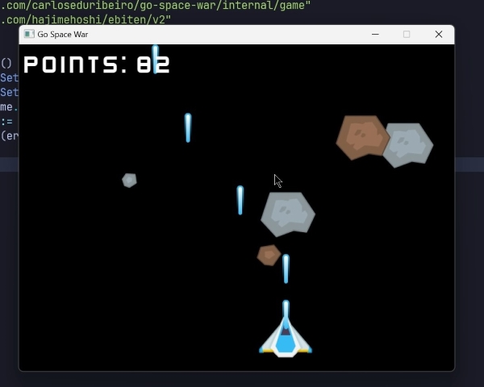

# go-space-war

## Descricao

**Jogo 2D** desenvolvido em Go utilizando a _[Ebiten Engine](https://ebitengine.org/)_.



## Como executar

```shell
git clone https://github.com/carloseduribeiro/go-space-war.git
cd ./go-space-war
go mod tidy
GOOS=windows|linux|darwing go run .
```

**Obs.:** Mofifique a variável ```GOOS``` de acordo com o seu sistema operacional. Encontre mais informações sobre aqui: https://go.dev/src/go/build/syslist.go

## Créditos

Jogo desenvolvido baseado no vídeo da [mariarobertap](https://github.com/mariarobertap). Mais informações no repositório do projeto: https://github.com/mariarobertap/go-space-game/tree/lite

